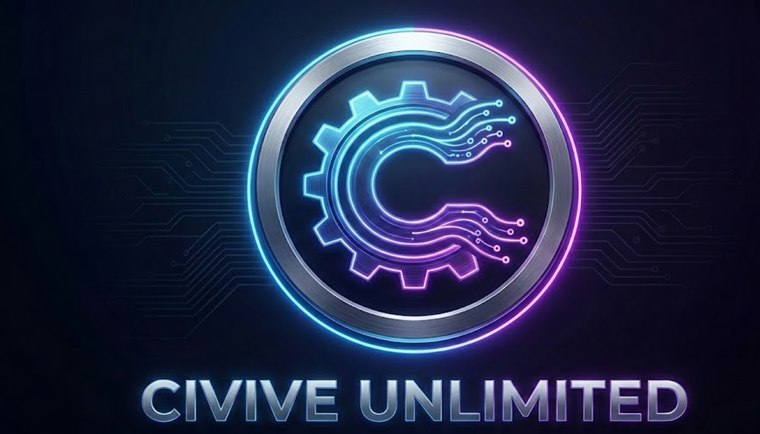
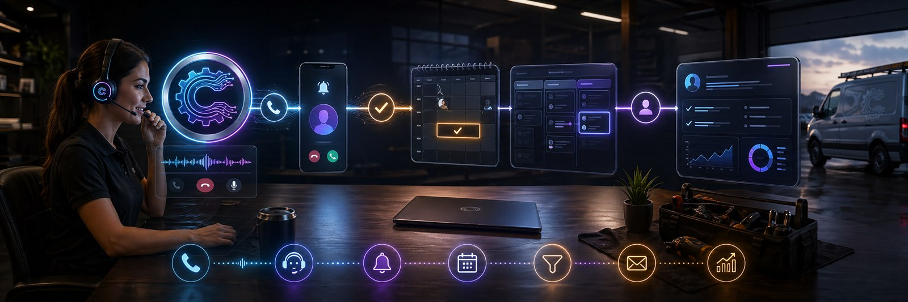

  

<h1 align="center">Civive Unlimited</h1>

  <strong>AI growth systems for businesses that cannot afford to miss calls, leads, or follow-up.</strong>

  AI receptionists | missed-call recovery | booking automation | CRM follow-up | AI search visibility

  
  
  

## What Civive Builds

Civive Unlimited builds practical AI operating systems for local and service businesses. The goal is simple: answer faster, qualify better, book more reliably, follow up longer, and turn more demand into revenue.

We focus on systems that sit close to the money:

- AI receptionists and voice agents for inbound calls, qualification, and routing
- Missed-call recovery that turns lost calls into conversations and bookings
- Booking flows, lead intake, pipeline hygiene, and CRM automation
- GoHighLevel-style follow-up systems for speed-to-lead and nurture
- AI Search Readiness audits that identify visibility gaps and improve the signals AI tools rely on
- Reusable software assets that can become repeatable client systems or productized SaaS features

## Operating System

| Layer | What it handles | Business outcome |
| --- | --- | --- |
| Capture | Calls, forms, chats, missed calls, and search intent | Fewer leads leak out of the business |
| Convert | AI receptionist flows, qualification, scheduling, and handoff | More booked conversations from the same demand |
| Follow up | CRM tasks, SMS/email nurture, pipeline movement, and reminders | Prospects keep moving after the first touch |
| Measure | Source tracking, audit reports, booking data, and system health | Operators can see what is working |
| Improve | Reusable scripts, agents, playbooks, and product modules | Every client build strengthens the next one |

## Current Build Direction

| Area | Purpose |
| --- | --- |
| OpenClaw | Open-source AI operating partner for running business workflows, tools, checks, and handoffs |
| Civive Growth Systems | AI receptionist, missed-call recovery, lead automation, booking, and follow-up infrastructure |
| AI Search Readiness | Audits and fixes for businesses that need visibility in AI-generated recommendations |
| FoldScore | Landing-page intelligence and Fix Pack generation for faster conversion improvements |
| Client Delivery Assets | Repeatable systems, templates, dashboards, and automations for service businesses |

## Stack

  
  
  
  
  
  
  
  
  
  

## How We Work

Civive is built around execution, verification, and leverage. We prefer durable systems over one-off hacks: clean APIs, scripts, MCP-compatible tools, runbooks, dashboards, structured logs, and handoff notes that Scott, OpenClaw, and Codex can all use.

The best Civive systems are practical enough to help a business this week and structured enough to become stronger reusable software over time.

## Work With Civive

If your business is missing calls, responding slowly, losing leads after the first touch, or unsure how it shows up in AI search results, Civive can build the operating layer that closes the gap.

  <a href="https://www.civiveunlimited.com"><strong>Visit civiveunlimited.com</strong></a>
  &nbsp;|&nbsp;
  <a href="mailto:ceo@civiveunlimited.com"><strong>Email ceo@civiveunlimited.com</strong></a>

